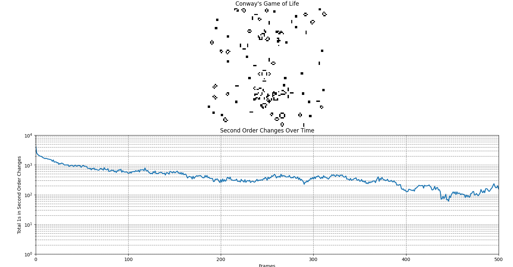

# Conway's Game of Life Simulation

This project simulates Conway's Game of Life, a cellular automaton devised by mathematician John Conway. The simulation includes a visualization of the grid's evolution over time and plots the second order changes to analyze the dynamics of the system.



## Overview

Conway's Game of Life consists of a grid of cells that evolve through discrete time steps according to a set of rules based on the states of neighboring cells. Each cell can be in one of two states: alive (1) or dead (0).

### Rules of the Game

1. **Birth**: A dead cell with exactly three live neighbors becomes alive.
2. **Survival**: A live cell with two or three live neighbors remains alive.
3. **Death**: In all other cases, a cell dies or remains dead.

## First Order and Second Order Changes

This simulation analyzes the complexity of the grid's evolution by calculating the first and second order changes:

- **First Order Changes**: This matrix is calculated as the absolute difference between the grid's state at time `t` and the state at time `t + 1`. It indicates cells that have changed their state in the next step.

  **First Order Changes** = | State at `t+1` - State at `t` |

- **Second Order Changes**: This matrix is derived from the first order changes. It represents the changes in the first order changes themselves from one step to the next.

  **Second Order Changes** = | First Order Changes at `t+1` - First Order Changes at `t` |

  The second order changes give insight into the dynamics and complexity of the evolving pattern, highlighting areas of rapid change or stabilization. If the graph drops to zero, it means the simulation has reached a converged state. Some times, more complex repetitive patters arise despite the blinker, so the graph will reach a constant oscilatory state rather droping to zero.

## Installation

To run this simulation, you need Python and the following packages installed:

- `numpy`
- `matplotlib`
- `scipy`

You can install the required packages using pip:

```bash
pip install numpy matplotlib scipy
```

## Usage

The main function in the script is `simulate_conway`, which runs the simulation. You can customize the simulation parameters such as grid size, number of frames, and animation speed.

### Example

```python
simulate_conway(size=(100, 100), frames=2000, speed=1000.0)
```

- **`size`**: Tuple specifying the dimensions of the grid.
- **`frames`**: Number of frames to simulate.
- **`speed`**: Speed of the animation in frames per second.

### Visualizations

- The top plot displays the grid, showing live cells as black squares.
- The bottom plot shows the logarithm of the second order changes over time, illustrating the dynamic complexity of the system.

## Contact

For questions or collaboration, please reach out:

- **Email**: [j.dpadron@alumnos.upm.es](mailto:j.dpadron@alumnos.upm.es)
- **Twitter**: [@mixnikon](https://twitter.com/mixnikon)

## Additional Information

For more information and related projects, please visit the GitHub repository: [conway-complexity](https://github.com/Mixnikon108/conway-complexity).

## License

This project is licensed under the MIT License. See the [LICENSE](LICENSE) file for details.


### Key Updates
- **Removed LaTeX**: Changed mathematical expressions to plain text for compatibility with GitHub's Markdown.
- **Contact and Links**: Updated contact information and added a link to the GitHub repository.

This version should display correctly on GitHub, providing clear instructions and explanations without the use of unsupported syntax.
